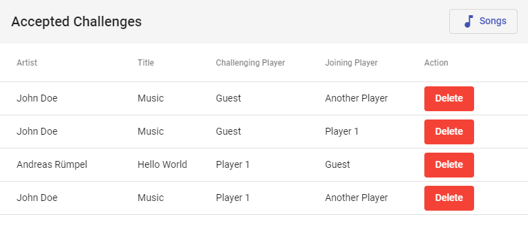

# Nucantus Karaoke Challenge Web Application

Nucantus organizes challenges at your karaoke party. First, the party organizer distributes a participation link.
Players may browse a song list and challenge a song by typing in their player name. Other players see open challenges
and accept them by joining a song with their player name. A challenge view lists all accepted challenges and tells you,
which song to start next in your karaoke software.

This app is the user-facing frontend for the [Nucantus Service](https://github.com/ruempel/nucantus-service), which
provides a song list and karaoke challenge management REST API.

## How to Configure

- configure URL of Nucantus Service API in `*.ts` files at `src/environments/`
- configure port of nginx serving the app in `docker-compose.yaml`

## How to Build and Run

Run `docker-compose up -d` to bring up an nginx HTTP server listening on port 80.

Run `ng serve` for a development server. Navigate to `http://localhost:4200/`. The app will automatically reload if you
change any of the source files.

## How to Use (Challenge Songs and Accept Challenges)

The app will bring up the song list, which lets you change your player name and start or join challenges. Another button
navigates you to the challenge list, which is updated every few seconds. You can delete finished or unwanted challenges
there.

